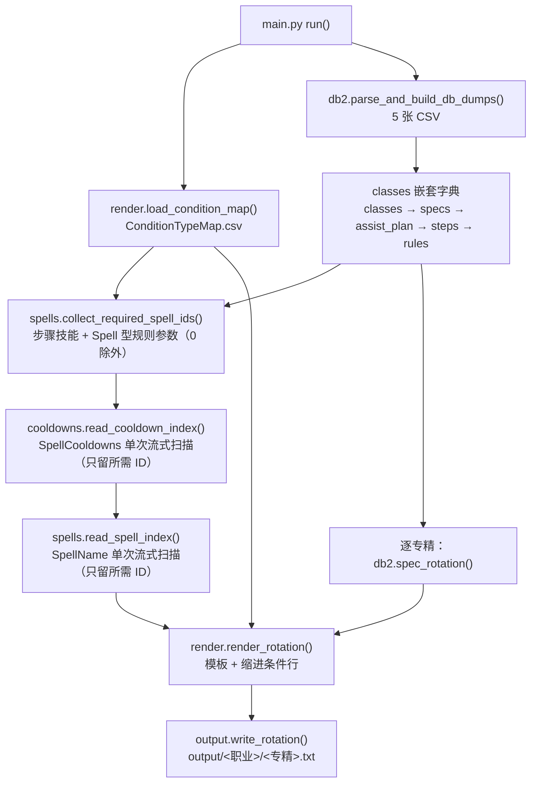

# wow_assist_mapper 项目逻辑说明

本文档描述这个项目「输入什么、内部怎么组织、输出什么、有哪些已知坑」。
代码快照：`main.py` + `app/`（第一期重构后的脚本型结构）；数据快照：`12.1.0.69814`。

---

## 1. 项目定位

一句话：**把《魔兽世界》客户端 DB2 表导出的 CSV（辅助战斗 / 一键循环相关表），翻译成人类可读的「技能优先级列表」文本。**

用途与动机：

- 可以借此对官方推荐循环提出改进建议；
- 可以看到「为什么它决定放这个技能」，从而更好地学习循环；
- 可以在「一键模式」与「手动技能」之间取舍，减少 GCD 损失。

项目本身**不连接游戏、不注入进程**，是一条纯离线的数据管线：读 CSV → 本地查技能名 → 拼装嵌套对象 → 渲染文本。

---

## 2. 快速上手

### 安装

```powershell
python -m venv .venv
.venv\Scripts\python.exe -m pip install -r requirements.txt   # 只有 pandas
```

### 运行

```powershell
# 必须在仓库根目录执行；无命令行参数，一次生成全部有方案的专精
.venv\Scripts\python.exe main.py
```

输出写入 `output/<职业小写无空格>/<专精小写无空格>.txt`（40 个文件 / 13 个职业目录）。

换游戏版本时改 `main.py` 顶部的全局变量：`VERSION`、`CSV_DIR`、`OUTPUT_DIR`、
`CONDITION_MAP_FILE`、`LOG_LEVEL`（调试时可设为 `logging.INFO` 观察逐行加载过程）。

### 测试

```powershell
.venv\Scripts\python.exe -m pytest tests -q
```

`tests/` 覆盖：表规模、专精查找的同职业限定、技能名命中/缺失占位、冷却两列取大与 cd 标签
（含独立重算校验）、充能层数与 automation-only 渲染、未知条件类型报错、整库生成到临时目录后
的结构与计数。

---

## 3. 仓库结构（第一期重构后）

```
main.py                  # 唯一入口：全局配置 + 全量生成编排
app/
  __init__.py            # 包说明
  db2.py                 # 5 张 CSV → classes/specs/assist_plan/steps/rules 嵌套结构
  spells.py              # SpellName 表单次流式扫描，建立"本次需要"的技能名索引（负责 cd 标签）
  cooldowns.py           # SpellCooldowns 表单次流式扫描，两列取大得到技能冷却毫秒
  render.py              # 条件映射表加载 + 模板渲染（4 空格缩进条件行）
  output.py              # 命名规则与写文件
csv_table/               # DB2 导出 CSV：必需的 5 张业务表 + SpellName + SpellCooldowns
output/                  # 生成结果（40 个专精文本，按项目约定入库）
tests/                   # pytest 测试（conftest 提供会话级夹具）
ConditionTypeMap.csv     # 条件类型 → 文本模板（人工维护）
requirements.txt         # pandas（运行时）；pytest 以注释标明（测试时）
README.md / LICENSE.txt  # 说明与 MIT 许可
.script/                 # 本机调查/比对用的一次性脚本（已被 .gitignore 排除，不在仓库与运行路径上）
```

数据导出地址等本机备忘不入库（`.gitignore` 已排除 `Note.txt`），仓库只保存表文件本身。

与旧结构相比：`src/wow_assist_mapper/skeleton.py` 的单文件逻辑拆到了 `app/` 四个模块；
`data/`（含 Wowhead 缓存与参考笔记）、`docs/`（PyScaffold 脚手架）、`out/`（11.2 旧产物）
以及 PyScaffold 模板文件已删除；不再有 console script、argparse 与打包元数据。

---

## 4. 输入数据

### 4.1 五张 DB2 导出表（`csv_table/`）

> 除下面 5 张业务表外，`SpellCooldowns.12.1.0.69814.csv`（36,334 行）也是运行必需的输入表：
> 列为 `ID,DifficultyID,CategoryRecoveryTime,RecoveryTime,StartRecoveryTime,AuraSpellID,SpellID`，
> 冷却值取第 3 列 `CategoryRecoveryTime` 与第 4 列 `RecoveryTime` 的较大值（同一 SpellID
> 多行再取最大），第 5 列 `StartRecoveryTime` 是 GCD 类字段、不参与计算。`app/cooldowns.py`
> 同样是单次流式扫描、内存只保留所需 ID，但为了让同一 SpellID 取到全部行的最大值，冷却表
> 必须整表读完（SpellName 表则在所需 ID 全部命中后即可停止）；本次 551 个需求 ID 命中 334 个，
> 其中冷却大于 1 秒的 141 个会在输出里带 `,cd:<整数秒>` 标签（见 4.4 / 第 8 节）。

| 文件 | 主键 | 用到/相关的列 | 作用 |
| --- | --- | --- | --- |
| `ChrClasses.12.1.0.69814.csv` | `ID` | `ID`、`Name_lang`（如 `Death Knight`） | 职业表，内存结构的顶层（15 行 = 13 玩家职业 + Adventurer + Traveler） |
| `ChrSpecialization.12.1.0.69814.csv` | `ID` | `ID`、`ClassID`、`Name_lang`（如 `Beast Mastery`） | 专精表，挂到对应职业下（60 行） |
| `AssistedCombat.12.1.0.69814.csv` | `ID` | `ID`、`ChrSpecializationID` | 「辅助战斗方案」，一个专精一个方案（40 行） |
| `AssistedCombatStep.12.1.0.69814.csv` | `ID` | `ID`、`SpellID`、`AssistedCombatID`、`OrderIndex` | 方案中的步骤（693 行），每步对应一个技能 |
| `AssistedCombatRule.12.1.0.69814.csv` | `ID` | `ID`、`OrderIndex`、`ConditionType`、`ConditionValue1..3`、`AssistedCombatStepID`、`Field_11_1_7_60520_002` | 步骤上的触发条件（3116 行） |

表间关系：

```
ChrClasses 1 ── n ChrSpecialization 1 ── 1 AssistedCombat 1 ── n AssistedCombatStep 1 ── n AssistedCombatRule
                     (ClassID)                (ChrSpecializationID)     (AssistedCombatID)      (AssistedCombatStepID)
```

读取参数固定为 `quoting=0, engine='python', quotechar='"'`（`app/db2.py`）：
`ChrSpecialization.Description_lang` 含换行与逗号，必须用 python 引擎才能正确合并多行字段。

### 4.2 `SpellName.<版本>.csv`

技能 ID → 名称（`ID,Name_lang`，字段带引号、值里可能有逗号）。文件约 11MB / 41.4 万行，
**按 UTF-8 读取**，其中技能名以 zhCN 为主（少数旧条目仍是英文原名），输出文本里的技能名即取自这里。
`app/spells.py` 用标准库 `csv` **单次顺序扫描**，只把"本次需要"的 ID（步骤技能 + Spell 型规则参数，
本期 551 个）放进内存，所需 ID 全部命中后立即停止读取。

### 4.3 条件模板表 `ConditionTypeMap.csv`

人工维护的映射表，列：`Type`（条件类型编号 0–70）、`Enum`（DB2 枚举名）、`Active`（Y/N）、
`Description`（文本模板，含 `{spell}` / `{arg1}` / `{arg2}` / `{arg3}` 占位符）、
`Value1`–`Value3`（各占位符的语义标签）。

```csv
Type,Enum,Active,Description,Value1,Value2,Value3
0,ASSISTED_COMBAT_RULE_TYPE_SPELL_LEARNED,Y,若已点出天赋 {spell},UNUSED,UNUSED,UNUSED
15,ASSISTED_COMBAT_RULE_TYPE_AURA_MISSING_TARGET,Y,若目标没有增益/减益 {arg1},Spell:Buff,UNUSED,UNUSED
63,ASSISTED_COMBAT_RULE_TYPE_SPELL_CHARGES_GREATER,Y,若技能 {spell} 的充能层数大于等于 {arg1},Charge Count,UNUSED,UNUSED
70,ASSISTED_COMBAT_RULE_TYPE_AUTOMATION_ONLY,Y,仅自动化施放（不属于游戏的辅助战斗循环）,UNUSED,UNUSED,UNUSED
```

`ValueN` 列的意义：当它以 **`spell` 开头**（不分大小写，如 `Spell`、`Spell:Buff`）时，
渲染阶段会把 `ConditionValueN` 当成技能 ID，先去 `SpellName` 表查名字再填进模板。
`Active` 列只是人工标注，渲染不读取（12.1 数据里 13 / 24 / 26 / 36 四种类型标着 N 但实际出现）。
本期只把 `Description` 列的模板文案整体汉化；`Type` / `Enum` / `Active` / `Value1`–`Value3`
（包括 `Spell:Buff` 这类机器语义标签）保持英文不变。

### 4.4 关键约定

- 距离单位是**码（yards）**，时间单位是**毫秒**，`*_PCT_*` 是百分比整数。
- **比较措辞只用四个数学用语**：`大于` / `大于等于` / `小于` / `小于等于`，不再出现 高于/低于/超过/少于
  这类描述。每个条件类型取哪个运算符，以 SimulationCraft 的 `parse_assisted_combat_rule`
  （`engine/player/player.cpp`）为准；SimC 自己标注这些运算符未经游戏侧验证，而数据侧读法只有
  `>=` / `<=` 自洽（证据与取舍见第 9 节第 6 条）。SimC 对距离条件并不对称
  （类型 3 = `target.distance<=`、类型 4 = `target.distance>`），本项目照抄该不对称写法。
- 涉及「光环/增益」的条件，值填的是**技能 ID**（例如条件类型 15 + 值 `703` = 目标身上没有锁喉）。
- `AssistedCombatStep.OrderIndex` 与 `AssistedCombatRule.OrderIndex` 是游戏内的排序字段，
  但本管线**不按它排序**（见第 9 节）。
- **由 spellID 解析出的名称一律带 `[id:<spellID>]` 后缀**（步骤标题、`{spell}` 占位符、
  Spell 型条件参数），把输出文本与 DB2 的技能 ID 对应起来；冷却大于 1 秒时再追加
  `,cd:<整数秒>`（阈值与取整规则见第 8 节）；数值型参数（层数、距离、百分比、毫秒）不带标签。
- 技能名缺失（本期 3 个 ID）渲染为 `'Unknown Spell[id:<id>]'` 占位，不中断运行。

---

## 5. 总体数据流



调用链：

```
main.run()
  ├─ render.load_condition_map(CONDITION_MAP_FILE)
  ├─ db2.parse_and_build_db_dumps(CSV_DIR, VERSION)
  ├─ db2.iter_plan_steps() → spells.collect_required_spell_ids()
  ├─ cooldowns.read_cooldown_index(SpellCooldowns 表)
  ├─ spells.read_spell_index(SpellName 表, 冷却索引)
  └─ for (职业, 专精) in db2.iter_specs_with_plan():
         render.render_rotation() → output.write_rotation()
```

---

## 6. 内存数据结构

`db2.parse_and_build_db_dumps()` 的产物是一个多层嵌套 dict（伪代码）：

```python
classes = {
  "Rogue": {                              # key = ChrClasses.Name_lang（带空格）
    "raw_data": {...},                    # CSV 原始行
    "ID": 4,
    "Name": "Rogue",
    "specs": {
        259: {                            # key = ChrSpecialization.ID
          "raw_data": {...},
          "ID": 259,
          "Name": "Assassination",
          "assist_plan": {                # 只有方案表里出现的专精才有这个键
            "ID": 4,
            "steps": {
                0: {                      # key = AssistedCombatStep.OrderIndex
                  "ID": 12657,
                  "SpellID": 2823,        # 技能名不再存在这里，渲染时用技能名索引查
                  "OrderIndex": 0,
                  "rules": {
                      0: {                # key = AssistedCombatRule.OrderIndex
                        "ID": 55852,
                        "OrderIndex": 0,
                        "raw": {...}      # 规则 CSV 原始行；渲染只依赖它
                      },
                  },
                },
            },
          },
        },
    },
  },
}
```

要点：

- 归属关系都是**逐行扫描 + 反向查找**建立的：spec 按 `ClassID` 找职业，plan 按
  `ChrSpecializationID` 找 spec，step 按 `AssistedCombatID` 找 plan，rule 按
  `AssistedCombatStepID` 找 step。
- `steps` / `rules` 的字典**键**是 `OrderIndex`，但遍历顺序是**插入顺序（= CSV 行顺序）**。
  本期数据中没有重复键，因此条数与 CSV 行数一致（3116 条）；重复键会静默覆盖。
- 6 个宠物天赋专精（Ferocity / Cunning / Tenacity，`ClassID=0`）匹配不到职业，
  **不会出现在 `classes` 里**（与旧版行为一致），这也是"CSV 60 行专精 → 结构里 54 个"的原因。
- 各职业的 `Initial` 与 `Adventurer` 没有方案，`assist_plan` 键不存在，因此不参与输出。
- 旧版 `parse_and_build_db_dumps` 还返回一个无人使用的 `condition_types` 字典（类型 → 值串），
  第一期重构时移除了这个死返回值（对输出无影响）。

---

## 7. 模块职责与关键函数

### 7.1 `main.py`

| 名称 | 说明 |
| --- | --- |
| `VERSION` / `CSV_DIR` / `OUTPUT_DIR` / `CONDITION_MAP_FILE` / `LOG_LEVEL` | 全局配置，版本切换只改这里 |
| `run(csv_dir, output_dir, condition_map_file, version)` | 编排全流程，返回写出的文件数；参数默认值即全局配置（测试可传临时目录） |
| `build_spell_index(...)` | 收集所需 ID，扫描 SpellName 与 SpellCooldowns 两张表，返回 `(SpellIndex, 需求 ID 集合)` |

进度与汇总用 `print` 输出（每个专精一行 + 末尾合计）；`LOG_LEVEL=WARNING` 时只打印数据异常告警，
`LOG_LEVEL=INFO` 时还会打印技能 ID 与冷却命中数（`SpellCooldowns 命中 334 个，冷却 > 1 秒 141 个`）。

### 7.2 `app/db2.py`

| 名称 | 说明 |
| --- | --- |
| `table_filename(table_name, version)` | 拼文件名，如 `AssistedCombat.12.1.0.69814.csv` |
| `read_table(csv_dir, table_name, version)` | 按固定参数读一张表 |
| `parse_and_build_db_dumps(csv_dir, version)` | 构建第 6 节的嵌套结构，返回 `classes` |
| `iter_specs_with_plan(classes)` | 按类表/专精表行序产出 `(职业名, 专精数据)`，只含有方案的专精 |
| `find_spec(classes, class_name, spec_name)` | 按显示名在指定职业内精确查找（同名专精不会串职业） |
| `spec_rotation(spec_data)` | 取某专精的全部步骤（顺序 = CSV 行序） |
| `iter_plan_steps(classes)` | 遍历全部方案的步骤 |

处理规则行时，若 `Field_11_1_7_60520_002 != 0` 会打 WARNING（保留旧版的观察点；
12.1 数据里有 2 条：规则 67752 / 68820，字段值为 1，含义未明）。

### 7.3 `app/spells.py`

| 名称 | 说明 |
| --- | --- |
| `SpellIndex.get_name(id)` | 返回技能名；未收录返回 `None` |
| `SpellIndex.display_name(id)` | 返回**不带标签**的显示名；未收录返回 `Unknown Spell` |
| `SpellIndex.labelled(id)` | 返回 `<名称>[id:<spellID>]`，冷却 > 1 秒时追加 `,cd:<整数秒>`；未收录返回 `Unknown Spell[id:<spellID>]`（渲染统一入口） |
| `collect_required_spell_ids(steps, condition_map)` | 步骤技能 + ValueN 以 spell 开头的规则的参数，丢弃 0 |
| `read_spell_index(path, required_ids, cooldowns=None)` | 单次流式扫描，只保留所需 ID（命中完即停）；可选传入冷却索引供 cd 标签使用 |

旧版这里是 `check_spell_data()`：对每个 ID 访问 `https://www.wowhead.com/spell=<ID>`，
把结果缓存成 `data/wowhead/spells/spell_<ID>.json`（每个 ID 至少 2 秒，且无 timeout）。
新版本完全离线，这组抓取代码已删除。

### 7.4 `app/render.py`

| 名称 | 说明 |
| --- | --- |
| `load_condition_map(path)` | 读取映射表（参数同 db2） |
| `condition_props(condition_map, type, rule_id)` | 取映射行；缺行时抛带类型与规则 ID 的 `ValueError` |
| `render_rule(condition_map, rule, spell_id, spell_index)` | 渲染一条规则为一行（含 4 空格缩进）；`spell_id` 是该步的技能 ID |
| `render_rotation(condition_map, steps, spell_index)` | 渲染整段文本（不含首行专精名） |

渲染逻辑与旧版一致：`spell` = 当前步骤技能名（带单引号），`arg1..arg3` = `ConditionValue1..3`，
Spell 型列先解析成带单引号的技能名；模板执行 `eval('f"' + template + '"')` 得到最终行。
名称一律经 `SpellIndex.labelled()` 取值，因此步骤标题与条件行里的名称、ID 标签必然一致
（标题行用同一个 `spell_id`）。

**维护映射表时的限制（只针对模板，不针对技能名）**：

- `Description` 里不能出现双引号 `"`（会截断 `eval` 里的 f-string 字面量）；
- 不能出现反斜杠 `\`（会被当成转义字符）；
- `{` `}` 只允许是设计好的占位符 `{spell}` / `{arg1}` / `{arg2}` / `{arg3}`，不能有其它花括号；
- 技能名与条件值是作为**变量值**插入渲染结果的，不受上述限制：含括号等任意字符都安全
  （渲染不做二次解析；当前输出实例：`'PvP Rules Enabled (HARDCODED)[id:134735]'`，
  旧产物里还有 `'Word of Mass Recall (OLD)'` 这类带括号的名字）。

维护映射表后可以这样自检（仓库根目录执行，`chr(34)`/`chr(92)` 避免引号嵌套）：

```powershell
.venv\Scripts\python.exe -c "import pandas as pd; cm = pd.read_csv('ConditionTypeMap.csv', quoting=0, engine='python', quotechar=chr(34)); bad = [int(r.Type) for r in cm.itertuples() if chr(34) in r.Description or chr(92) in r.Description]; print('含危险字符的行:', bad)"
```

输出 `含危险字符的行: []` 表示模板安全；再用 `main.py` 跑一次全量能生成 40 个文件，
即可确认模板与占位符可用。

### 7.5 `app/output.py`

| 名称 | 说明 |
| --- | --- |
| `class_directory_name(name)` | `Death Knight` → `deathknight` |
| `spec_file_name(name)` | `Beast Mastery` → `beastmastery.txt` |
| `write_rotation(...)` | 写 `output/<职业>/<专精>.txt`（首行专精名 + 正文），返回路径 |

写文件用 UTF-8（无 BOM）+ `newline="\r\n"`：旧产物由 PowerShell 重定向生成，
是 CRLF + 末尾换行，这里显式保持一致的字节形态。

### 7.6 `app/cooldowns.py`

| 名称 | 说明 |
| --- | --- |
| `CooldownIndex.milliseconds(id)` | 返回技能冷却毫秒（同一 ID 多行取最大）；表中没有该 ID 返回 `None` |
| `CooldownIndex.seconds(id)` | 返回显示用整数秒 `(ms + 500) // 1000`；不存在或 ≤ 1000ms 返回 `None` |
| `read_cooldown_index(path, required_ids)` | 单次流式扫描 SpellCooldowns 表，内存只保留所需 ID；整表读完（同一 ID 需取全部行的最大值） |

冷却取第 3 列 `CategoryRecoveryTime` 与第 4 列 `RecoveryTime` 的较大值：只取第 4 列会漏掉
17 个"冷却只写在第 3 列"的技能（眼棱 198013、恶魔变形 191427、复仇之怒 31884 等）。
第 5 列 `StartRecoveryTime` 是 GCD 类字段，不参与计算；表里查不到冷却的技能不加 cd 标签。
秒数一律走 `seconds()`（半进；不用 Python 内置 `round()`，否则 4500ms 会因银行家舍入变成 4 秒），
`SpellIndex.labelled()` 只负责把它拼进标签，保证全项目只有一处取整逻辑。

---

## 8. 输出格式细节

固定结构（行结构与旧版 `out/*.txt` 一致；技能名带 `[id:<spellID>]` 标签、冷却 > 1 秒时再带
`,cd:<秒>`，文本不再与旧产物逐字节一致）：

```
<专精名>                                       ← 首行：输出层显式写入
<N>: Spell: <技能名>[id:<spellID>]              ← N 从 0 开始，是遍历序号，与 OrderIndex 无关
    <条件1>                                     ← 4 空格缩进，模板渲染结果
    <条件2>
```

冷却大于 1 秒的技能，标签写作 `<技能名>[id:<spellID>,cd:<整数秒>]`（如
`死神印记[id:439843,cd:45]`、`眼棱[id:198013,cd:30]`）。

条件模板的渲染规则：

| 占位符 | 取值来源 | 特例 |
| --- | --- | --- |
| `{spell}` | 当前步骤的技能名 | 用于「天赋已点 / 技能不可用 / 射程内 / 剩余充能」等以本技能为主语的条件；带步骤 `SpellID` 的标签 |
| `{arg1}` `{arg2}` `{arg3}` | `ConditionValue1..3` | 映射表对应 `ValueN` 以 `spell` 开头时，解析成带单引号、带自身 ID 标签的技能名 |

标签由 `SpellIndex.labelled()` 统一生成：格式为 `<名称>[id:<十进制 spellID>]`（无空格、不补零），
冷却大于 1 秒时追加 `,cd:<整数秒>`（秒数 = `(毫秒 + 500) // 1000`，按"0.5 向上"取整，
1500ms → `cd:2`、4500ms → `cd:5`；阈值按原始毫秒严格大于 1000 判断）。表中查不到该 ID
或冷却 ≤ 1000ms 时保持 `<名称>[id:<spellID>]`（如 0ms 的 `瞄准射击[id:19434]`、
正好 1000ms 的 `正义盾击[id:53600]`）。步骤标题行不加引号，条件行仍用单引号包裹；
SpellName 表里没有的 ID 输出 `Unknown Spell[id:<spellID>]`。
只有由 spellID 解析出的名称会带标签，数值型参数（层数 / 距离 / 百分比 / 毫秒）保持纯数字。
本期数据共 3431 处标签：693 个步骤标题 + 2738 条条件行；其中 935 处带 cd
（208 个步骤标题 + 727 条条件行），涉及 141 个不同技能 ID。

### 8.1 数据规模与覆盖（12.1.0.69814 实测）

| 指标 | 数值 |
| --- | --- |
| 职业 / 专精 CSV 行数 | 15 / 60（其中 54 个挂到职业下：6 个宠物天赋专精 `ClassID=0`） |
| 有方案的专精 / 覆盖职业 | 40 / 13（Adventurer、Traveler 无方案） |
| 方案 / 步骤 / 规则 | 40 / 693 / 3116 |
| 规则中出现的条件类型 | 55 种（映射表 0–70 共 71 行；未使用的 16 种，其中 15 种标 `Active=N`） |
| 需要解析名字的技能 ID | 551 个（步骤技能 + Spell 型规则参数去重、去 0） |
| SpellName 命中 / 缺失 | 548 / 3（缺失：194310、389387、470058） |
| SpellCooldowns 命中 / 冷却 > 1 秒 | 334 / 141（其余 217 个需求 ID 在冷却表里没有记录） |
| 输出里的 `[id:` 标签 | 3431 处（693 个步骤标题 + 2738 条条件行；其中 3 处为 `Unknown Spell[id:…]`） |
| 输出里带 `,cd:` 的标签 | 935 处（208 个步骤标题 + 727 条条件行，141 个不同技能 ID） |
| 输出文件 | 40 个 / 13 个职业目录 |

### 8.2 与旧版 11.2 产物的比对结论（第一期验证）

> 第二期起技能名追加 `[id:<spellID>]` 标签、本期起冷却 > 1 秒的技能再追加 `,cd:<整数秒>`，
> 产物不再与旧版逐字节一致；下列结论只针对行结构，仍然成立。

- 文件集合：旧 39 个 → 新 40 个（新增 Demon Hunter / Devourer）；
- 结构：两者的首行形态、`N: Spell:` 编号连续性、条件行 4 空格缩进都一致，无异常；
- 旧产物的已知缺陷 `if player has more than 'Spells' charges of spell 'Aimed Shot'`
  等 12 处「技能名当层数」在 12.1 数据下不再出现（类型 63 的 10 条全部输出数字层数）；
- 新旧条件行形态差异来自 12.1 数据本身（新技能、新条件类型），不是格式差异。

---

## 9. 本期确认的结论与修正

1. **类型 70 = `ASSISTED_COMBAT_RULE_TYPE_AUTOMATION_ONLY`（新增映射行）**
   SimulationCraft midnight 分支把该类型视为「仅属于暴雪自动化（自动施放）」的标记，
   不产生条件表达式。本期数据 46 条（46 个 step，均为该 step 最后一条条件，涉及 27 个专精），
   `ConditionValue1..3` 全为 0。渲染为映射表新增的说明行：
   `仅自动化施放（不属于游戏的辅助战斗循环）`。
2. **类型 63/64 的 `Value1` 语义 = 充能层数**：映射表原来的 `Spell Charges` 以 "spell" 开头，
   被当作技能 ID 去查名字，旧产物因此出现 `'Spells' charges`（查不到 ID 时甚至查到别的技能名）。
   现改为 `Charge Count`，直接输出数字。12.1 的 10 条类型 63 规则 `ConditionValue1` 全为 2，类型 64 无数据。
3. **缺失技能名的占位**：`194310 / 389387 / 470058` 在 SpellName 表中不存在（各被 1 条规则引用），
   渲染为 `'Unknown Spell[id:<id>]'`（ID 由统一标签承载），不再中途失败。
4. **未知条件类型报错**：映射表缺行时不再让 `iloc[0]` 抛 `IndexError`，
   而是抛 `ValueError`（带 `ConditionType` 与规则 ID），便于定位要补的映射行。
5. **技能冷却标签（本期新增）**：`SpellCooldowns.<版本>.csv` 从"预置未用"变为运行必需；
   冷却取第 3/4 列较大值（同一 SpellID 多行再取大），原始毫秒 > 1000 时在标签后追加
   `,cd:<整数秒>`（半进，见 7.6 / 第 8 节）。本期输出 935 处标签带 cd，涉及 141 个技能 ID。
6. **条件模板的比较措辞统一为四个数学用语（本期修正）**：`ConditionTypeMap.csv` 里 55 行带比较的
   `Description` 从 高于/低于/超过/少于/至少还剩 改为 `大于` / `大于等于` / `小于` / `小于等于`，
   运算符逐条对齐 SimulationCraft midnight 分支的 `parse_assisted_combat_rule`
   （`engine/player/player.cpp:3772-4124`，`AC_*` 枚举见 `engine/dbc/data_enums.hh`），
   例如 `AC_HOLY_POWER_GREATER` → `holy_power>=`、`AC_COMBO_POINTS_GREATER` → `combo_points>=`、
   `AC_ARCANE_CHARGES_GREATER` → `buff.arcane_charge.stack>=`、`AC_SPELL_CHARGES_GREATER` →
   `charges>=`。SimC 自己在 `player.cpp:3799` 标注
   `TODO: verify < vs <= and > vs >= on all condition types`，而数据侧读法只有 `>=` / `<=` 自洽：
   规则 6392 是「神圣能量 5」（等于该资源上限，严格 `>` 时规则恒假）、规则
   41712 / 41720 / 41728 / 41736 是「连击点 5 / 6 / 6 / 7」（随天赋变化的连击点上限）、
   奥术充能 4（等于充能上限）。两类特殊处理：类型 3/4 的距离条件照 SimC 原样保持不对称
   （类型 3 = `target.distance<=` → 「小于等于」，类型 4 = `target.distance>` → 「大于」）；
   类型 17/18 旧文案「至少还剩」与 SimC 的 `{}.remains<=` 相反，本次一并改为
   「剩余时间小于等于」，属于语义修正而非仅换词。

---

## 10. 已知问题、脆弱点与 TODO

### 10.1 输出顺序不按 `OrderIndex`（重要，未改）

`steps` / `rules` 都是普通 dict，键是 `OrderIndex`，遍历用 `.values()` 得到的是
**插入顺序 = CSV 行顺序**。12.1 数据里 40 个方案的步骤行序**没有一个**是按 `OrderIndex`
升序排列的（规则层面 654 个步骤中有 15 个不是升序），所以文本的「第 N 条」并不代表
游戏内优先级第 N 条；CSV 行序变化会直接改变输出。若要按游戏逻辑展示，
应改为 `sorted(..., key=OrderIndex)`（属于后续阶段）。

### 10.2 规则键冲突会静默覆盖

`rules[OrderIndex] = ...` 若同一 step 出现重复 `OrderIndex`，后写覆盖先写。
本期数据经检查没有重复（693 步 / 3116 规则全部保留），但这是无保护的假设。

### 10.3 模板渲染用 `eval`

`eval('f"' + template + '"')`：模板来自人工维护的 CSV，一旦模板里出现双引号、反斜杠或
计划外的花括号，就会渲染失败或产生意外结果（技能名等变量值不受影响，见 7.4）。
更稳妥的做法是显式格式化或语义化占位符替换（后续阶段）。

### 10.4 部分条件类型的参数语义与实际数据不符（未修正）

- 类型 13（`AURA_COUNT_NEAR_PLAYER_GREATER`）的 `Value3` 是技能 ID（6 条规则全为 703 锁喉 / 1943 割裂），
  但映射表标 `UNUSED`，因此中文模板里的 `{arg3}` 仍渲染为裸数字（如
  `若玩家周围 10 码内带有增益/减益 1943 的目标数量大于等于 1 个`），不会解析成技能名
  （对照类型 51 的 `Spell:Buff`，同一位置渲染为带标签的技能名，如
  `若玩家周围 10 码内带有增益/减益 '锁喉[id:703,cd:6]' 的目标数量小于等于 1 个`）。
- 类型 9（`AURA_ON_PLAYER`）有 3 条规则的 `ConditionValue2` 非 0、1 条规则的 `ConditionValue3` 非 0，
  看起来也是技能 ID，但映射表标 `UNUSED`，这些值被忽略。

### 10.5 `Field_11_1_7_60520_002` 语义未明

12.1 数据里有 2 条规则该字段为 1（规则 67752 / 68820，代码保留非 0 告警），含义待查。

### 10.6 其他

- 宠物天赋专精（Ferocity / Cunning / Tenacity）的 `ClassID=0`，不挂到任何职业下；
  它们本来也没有辅助方案，因此不影响输出，但会让"CSV 专精行数"与"结构里的专精数"不一致。
- `Adventurer` / `Traveler` 两个新职业没有方案，属于客户端角色创建相关条目。
- 技能名语言：`SpellName.12.1.0.69814.csv` 提供 zhCN 名称（UTF-8，少数旧条目仍是英文原名），
  输出文本因此是中文技能名（见 4.2）；仓库里没有单独的 enUS 文件。
- `data/reference/*.txt`（旧的人工研究笔记）随 `data/` 删除；条件类型的结论已并入本文档。
- 环境说明：本期在 Python 3.13 + pandas 3.0.5 上跑通（`requirements.txt` 只要求 `pandas>=2.3.1`）。
- 待办：HTML 可视化版本；弄清部分规则为何互相矛盾（疑似隐含 OR）；
  复核无规则的步骤（如 Balance 的某个 Moonfire）是否根本不该被越过；打印序号改为 1 基。

---

## 11. 一句话总结

`wow_assist_mapper` 是一条**单向离线数据管线**：`5 张 DB2 CSV + SpellName + SpellCooldowns + 人工条件模板`
→ `classes/specs/plan/steps/rules 嵌套字典` → `output/` 下每个专精一份可读文本。
核心复杂度在条件模板映射；顺序语义、`eval` 渲染、部分参数语义是当前最薄弱的三处。
